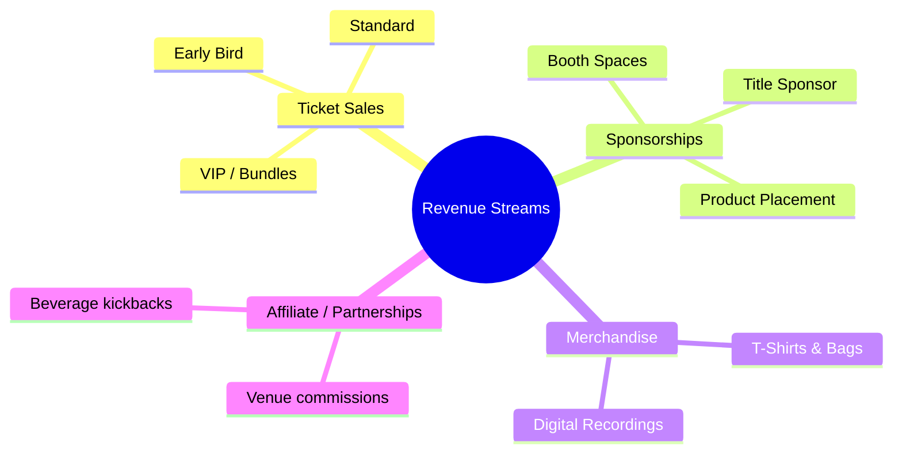

Making organizers money.

## Income Diversification Matrix

## Practical Rules for Profitability
*   **Target a 40% Margin**: Budget your fixed overhead (venue, speakers, lighting) to break even at 60% of total expected ticket capacity.
*   **Up-sells**: Offer bundles (e.g., Ticket + Drink Coupon + Merch) at checkout. This can increase average order value (AOV) by 30%.
*   **Sponsorship Packages**: Pitch sponsors with clear activation opportunities, not just logo placements.
