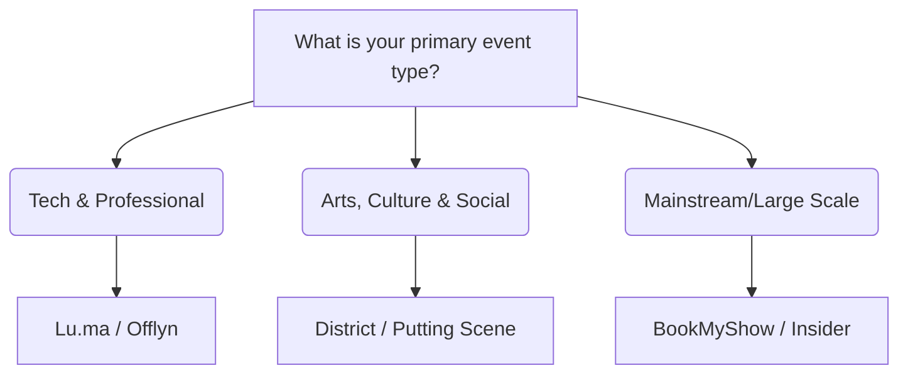

How to pick a primary platform, and what to keep in mind.

## Selection Decision Tree

## Key Evaluation Criteria

1.  **Platform Fee**: Calculate the total fee (Platform Commission % + Payment Gateway Fee % + GST on fees).
2.  **Payout Speed**: How fast do you need the capital to settle supplier costs?
3.  **Discovery Support**: Does the platform list your event in its recommendation feed or weekly newsletters?
